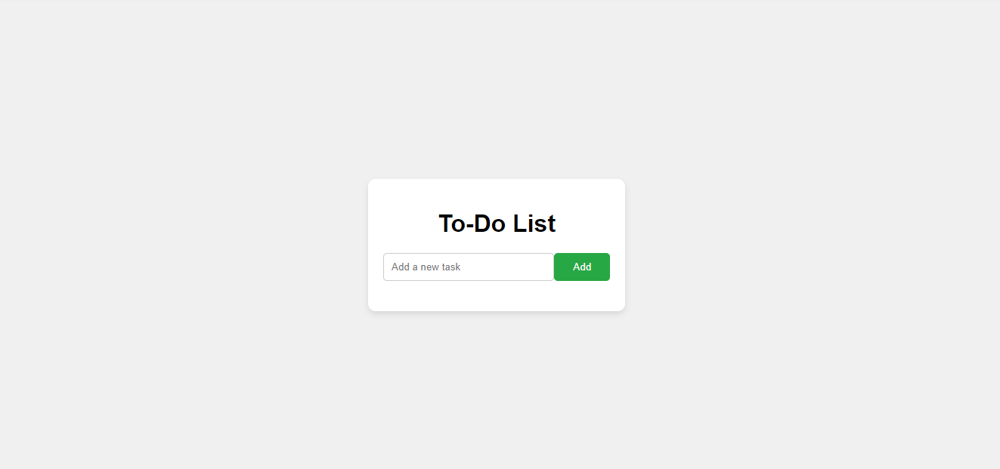
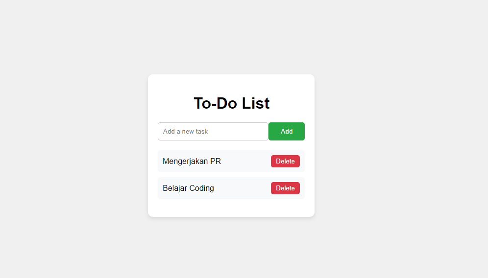
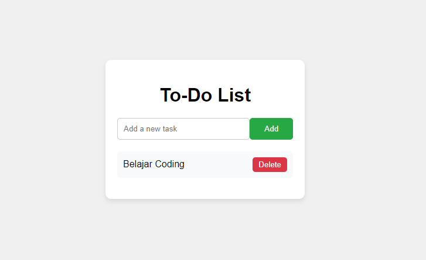

# digikidz
Kategori Lomba Coding 10-16 Tahun 

# Project
Siswa dapat membuat aplikasi todo-list sederhana menggunakan Javascript, HTML, dan CSS.

### Tampilan
Tampilan project yang dapat dibuat peserta lomba.

Aplikasi harus bisa menambahkan list.

Tampilan aplikasi ketika berhasil menambahkan list nya.

Tampilan aplikasi ketika berhasil delete salah satu listnya.

